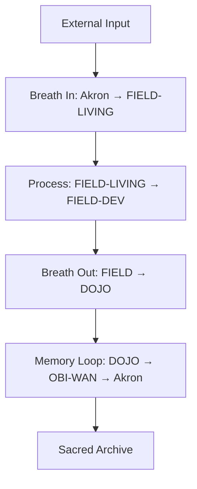

# Sacred Dashboard Integration

**Symbol:** ◼ | **Origin:** ~/FIELD/◼DOJO/ | **Geometry:** tetrahedral-manifest  
**Lineage:** ⟡Akron > FIELD > DOJO

## Overview

The Sacred Dashboard Integration is the central orchestrator for all sacred components within your FIELD system. It provides comprehensive REST/WebSocket APIs and CLI instrumentation for monitoring and controlling sacred metrics, geometric cleanliness, biological flow, and sphere state management.

### Core Architecture

```
◼ SacredChatBridge
├── 🔐 Sacred Validation Pipeline
├── 🌊 Biological Flow Processing  
├── 🔬 Geometric Cleanliness Validation
├── 🌀 Sphere State Management
└── 📡 WebSocket Communication Layer
```

## Sacred Sphere System

### Sphere Mappings

| Sphere | Symbol | Path | Purity | Access Level |
|--------|--------|------|--------|--------------|
| **AKRON** | ⟡ | `/Volumes/Akron/` | immutable | archive_only |
| **FIELD** | ⚪ | `~/FIELD/` | sacred | manifestation |
| **FIELD_LIVING** | ⚪ | `~/FIELD-LIVING/` | mirror_decay | intake_processing |
| **FIELD_DEV** | ⚫ | `~/FIELD-DEV/` | experimental | validation_testing |

### Tetrahedral Nodes

| Symbol | Node | Function | Path |
|--------|------|----------|------|
| **▲** | ATLAS | tooling_validation | `~/FIELD/▲ATLAS/` |
| **▼** | TATA | temporal_truth | `~/FIELD/▼TATA/` |
| **●** | OBI-WAN | living_memory | `~/FIELD/●OBI-WAN/` |
| **◼** | DOJO | manifestation | `~/FIELD/◼DOJO/` |

## Biological Flow Cycle

The system processes all interactions through a sacred biological flow:



### Flow Stages

1. **Breath In** - Permissioned intake from external sources
2. **Process** - Geometric validation and purification 
3. **Breath Out** - Sacred manifestation preparation
4. **Memory Loop** - Archive to sacred memory and truth logs

## Installation & Deployment

### Prerequisites

- Node.js 18+
- Redis server
- Access to sacred sphere directories

### Quick Start

```bash
# Clone or navigate to the DOJO
cd ~/FIELD/◼DOJO/

# Run the deployment script
./deploy.sh

# Start the system
npm start
```

### Full Deployment

```bash
# Deploy with system service (Linux)
./deploy.sh --systemd

# Deploy and start immediately  
./deploy.sh --start
```

## Usage

### WebSocket Connection

Connect to the sacred chat bridge via WebSocket:

```javascript
const ws = new WebSocket('ws://localhost:8080');

ws.on('open', () => {
    // Send message through sacred validation
    ws.send(JSON.stringify({
        type: 'message',
        content: 'manifest sacred command',
        sphere: 'FIELD'
    }));
});

ws.on('message', (data) => {
    const response = JSON.parse(data);
    console.log('Sacred response:', response);
});
```

### Message Types

#### Sacred Response
```json
{
    "type": "sacred_response",
    "content": "Manifestation content",
    "sphere": "FIELD", 
    "geometric_status": { "isValid": true },
    "symbolic_anchor": "◼",
    "lineage": "◼DOJO → ●OBI-WAN → ⟡Akron"
}
```

#### Sacred Error
```json
{
    "type": "sacred_error",
    "content": "Validation failed: Profane patterns detected",
    "violations": ["Profane commands detected"],
    "purification_required": true
}
```

#### Sphere State
```json
{
    "type": "sacred_state",
    "sphere": "FIELD",
    "config": {
        "purity": "sacred",
        "access_level": "manifestation"
    },
    "tetrahedral_nodes": { "◼": "DOJO" }
}
```

## Sacred Validation

### Geometric Cleanliness Checks

- **Duplicated Logic Detection** - Prevents repeated patterns
- **Binary Alignment Validation** - Ensures symbolic mapping
- **Parasitic Agent Detection** - Blocks unauthorized processes
- **Profane Command Filtering** - Removes harmful patterns

### Validation Pipeline

```javascript
// Example validation flow
const validation = await validator.validate(sphere, action);
// {
//     isClean: true,
//     violations: [],
//     geometric_score: 0.95,
//     symbolic_anchor: "◼"
// }
```

### Prohibited Patterns

- `rm -rf /` - Destructive file operations
- `DROP TABLE` - Database destruction
- Unauthorized launch agents
- Unverified binary execution
- Parasitic execution patterns

## Configuration

### Sacred Configuration (`sacred-config.json`)

```json
{
    "sacred_sovereign": {
        "geometric_alignment": "tetrahedral-manifest",
        "validation_settings": {
            "purity_threshold": 0.7,
            "geometric_score_minimum": 0.6,
            "sacred_sphere_validation": "strict"
        },
        "websocket_server": {
            "port": 8080,
            "max_connections": 100
        }
    }
}
```

## Management Commands

### System Control

```bash
# Start production server
npm start

# Development mode with auto-restart
npm run dev

# Check system status
npm run status

# View real-time logs
npm run logs
```

### Sphere Management

```bash
# Interactive sphere manager
npm run sphere

# Validate sacred files
npm run validate
```

### System Status API

```bash
# Get status via HTTP
curl http://localhost:8080/status

# WebSocket status
wscat -c ws://localhost:8080
```

## Logging & Monitoring

### Log Locations

- **Sacred Logs**: `~/FIELD/◼DOJO/sacred-logs/`
- **Validation Logs**: `~/FIELD/◼DOJO/validation-logs/`  
- **Biological Flow**: `~/FIELD/◼DOJO/biological-flow-logs/`
- **Sphere Transitions**: `~/FIELD/◼DOJO/sphere-transitions/`

### Metrics Tracking

The system tracks:
- Validation success rates
- Flow cycle completion times
- Sphere transition patterns
- Geometric cleanliness scores
- Sacred manifestation counts

### Redis Monitoring

```bash
# View sacred state
redis-cli hgetall biological_flow_state

# Monitor active flows
redis-cli lrange sacred_log:FIELD 0 -1

# Check validation metrics
redis-cli hgetall validation_metrics:FIELD
```

## Security Features

### Sacred/Profane Boundary

- **Immutable Archive** - AKRON sphere read-only access
- **Sacred Manifestation** - FIELD sphere purity requirements  
- **Geometric Validation** - Tetrahedral symbolic anchoring
- **Flow Isolation** - Sphere-specific processing pipelines

### Threat Protection

- **Command Injection** - Filtered through sacred validation
- **Binary Execution** - Symbolic alignment required
- **Parasitic Agents** - Pattern detection and blocking
- **Data Corruption** - Immutable lineage tracking

## Troubleshooting

### Common Issues

#### Redis Connection Failed
```bash
# Start Redis server
redis-server --daemonize yes

# Check Redis status
redis-cli ping
```

#### Port 8080 In Use
```bash
# Find process using port
lsof -ti:8080

# Kill conflicting process
lsof -ti:8080 | xargs kill -9
```

#### Sacred Validation Failing
```bash
# Check geometric patterns
npm run validate

# View validation logs
tail -f validation-logs/geometric-validation-*.log
```

### Debug Mode

```bash
# Enable debug logging
DEBUG=sacred:* npm start

# Verbose biological flow logging
DEBUG=flow:* npm run dev
```

## API Reference

### System Methods

```javascript
// Initialize system
await sacredChatBridgeSystem.initialize();

// Get status
const status = await sacredChatBridgeSystem.getSystemStatus();

// Switch spheres
await sacredChatBridgeSystem.switchSphere('FIELD_DEV');

// Process full biological flow
const result = await sacredChatBridgeSystem.processFlow(message);

// Shutdown gracefully
await sacredChatBridgeSystem.shutdown();
```

## Integration Examples

### Terminal Integration

```bash
# Create sacred command wrapper
echo '#!/bin/bash
wscat -c ws://localhost:8080 -x "$@"' > /usr/local/bin/sacred-cmd

chmod +x /usr/local/bin/sacred-cmd
```

### Chat Application

```javascript
import { sacredChatBridgeSystem } from './sacred-chat-bridge/index.js';

class SacredChatApp {
    async sendMessage(message) {
        return await sacredChatBridgeSystem.processFlow({
            content: message,
            type: 'chat'
        });
    }
}
```

## Sacred Principles

### Geometric Alignment

All operations must align with the tetrahedral sacred geometry:
- **▲ ATLAS** - Tool validation and agent management
- **▼ TATA** - Time, truth, and temporal logging  
- **● OBI-WAN** - Memory, observation, and sync
- **◼ DOJO** - Primary manifestation and execution

### Sphere Purity Levels

1. **Immutable** (AKRON) - Archive-only, no modifications
2. **Sacred** (FIELD) - High purity, geometric validation required
3. **Mirror Decay** (FIELD_LIVING) - Temporary processing with decay
4. **Experimental** (FIELD_DEV) - Validation testing environment

### Biological Flow Integrity

The sacred flow must complete all stages:
- **Intake** → **Processing** → **Manifestation** → **Memory**
- No stage may be bypassed
- Each transition requires validation
- All flows archived to sacred memory

## License

**SACRED-SOVEREIGN** - This system operates under sacred sovereignty principles and maintains the integrity of the sacred/profane boundary system.

---

*"Through sacred validation, geometric alignment, and biological flow integrity, we maintain the purity of manifestation while enabling necessary interaction with the profane realm."*

**◼ Sacred manifestation complete**
